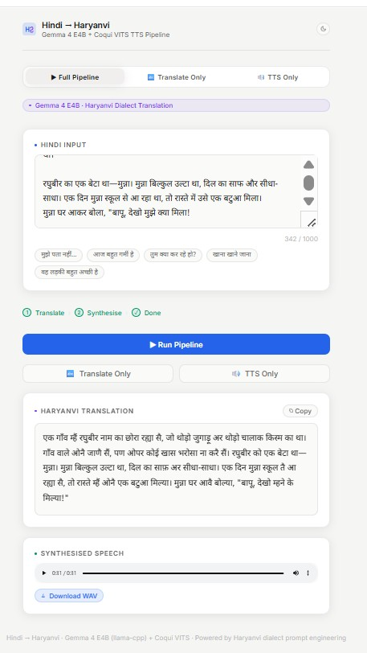
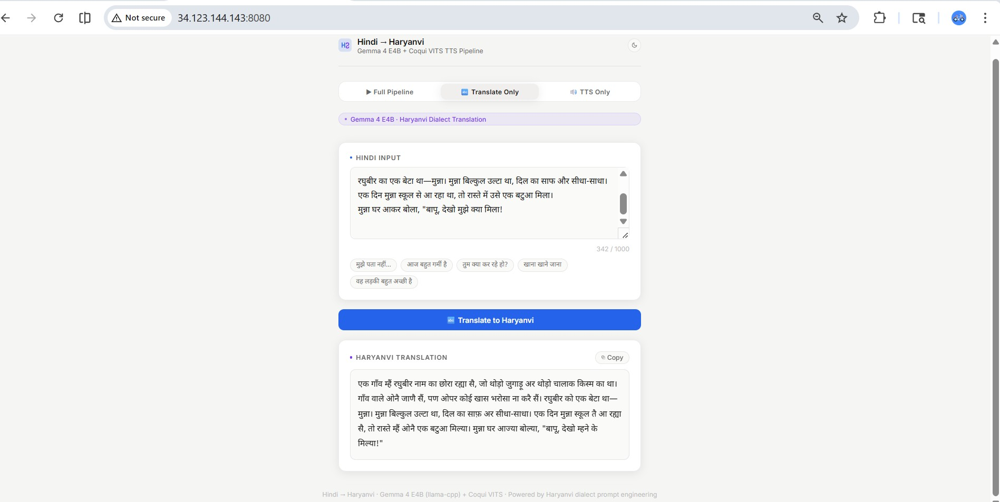

# Regional Dialect Synthesis Pipeline

### Hindi → Haryanvi (Bangru) → Speech

---

## 🚀 Overview

This project builds a **complete AI pipeline** that converts standard Hindi text into **spoken Haryanvi (Bangru dialect)**.

The system combines:

* **LLM-based Translation** (Hindi → Haryanvi)
* **Neural TTS** (Haryanvi → Speech)

---

## 🧠 Key Engineering Insight

This project follows a **research → production transition**:

### Phase 1 — Research (Training)

* Trained **LLaMA 3.1 (8B) using QLoRA**
* Dataset: **5,594 Hindi–Haryanvi pairs**
* Result: High-quality translation but **slow inference**

### Phase 2 — Production Optimization

* Switched to **Gemma GGUF model**
* Added **prompt engineering + few-shot examples**
* Result:

  * ⚡ Faster inference
  * ✅ Maintained acceptable dialect quality

👉 This tradeoff enables **real-time deployment**

---

## 🧠 System Architecture

```id="arch1"
Hindi Text
   ↓
Gemma (Prompt Engineered)
   ↓
Haryanvi Text
   ↓
VITS TTS Model
   ↓
Audio Output (.wav)
```

---

## 📓 Notebooks

- `llama-text-pipe-final.ipynb` → training LLaMA + QLoRA
- `coqui-tts-pipe-final.ipynb` → training VITS model

These notebooks were used for experimentation and training.  
The final deployed system uses optimized inference (Gemma GGUF + trained VITS checkpoint).

## ⚙️ Models Used

### 🔤 Translation Model

* Base: Gemma GGUF (local inference)
* Prompt-based dialect transformation
* Few-shot conditioning

### 🔊 Text-to-Speech Model

* Architecture: Coqui VITS
* Checkpoint: `best_model_16731.pth`
* Output: 22050 Hz audio

---

## ⚠️ What is Deployed vs Experimental

Deployed:
- Gemma-based translation
- VITS TTS model
- FastAPI backend

Experimental (Not deployed):
- LLaMA QLoRA trained model
- Training notebooks

## 🌐 Deployment

* **Backend:** FastAPI
* **Frontend:** Static HTML
* **Hosting:** GCP VM
* **Server:** Uvicorn

### Special Features

* Background model loading
* Async request handling
* Base64 + file-based audio responses

---

## ⚡ Quick Start

```bash id="run1"
pip install -r requirements.txt
uvicorn app.main:app --host 0.0.0.0 --port 8000
```

---

## 📡 API Endpoints

### 🔹 Health

```bash id="h1"
GET /health
```

---

### 🔹 Translate

```bash id="h2"
POST /api/translate
```

---

### 🔹 TTS

```bash id="h3"
POST /api/tts
```

---

### 🔹 Full Pipeline

```bash id="h4"
POST /api/pipeline
```

Response:

```json id="h5"
{
  "hindi": "तुम कहाँ जा रहे हो?",
  "haryanvi": "तू कड़े जा रया सै?",
  "audio_url": "/api/audio/<id>"
}
```

---

### 🔹 Full Pipeline (Base64)

```bash id="h6"
POST /api/pipeline/base64
```

---

## 📥 Example

Input:

```id="ex1"
तुम कहाँ जा रहे हो?
```

Output:

```id="ex2"
तू कड़े जा रया सै?
(Audio generated)
```

---

## 📁 Project Structure

```id="tree1"
app/                → FastAPI backend
app/models/         → translator + TTS
model_weights/      → GGUF + VITS weights
docs/               → documentation
notebooks/          → training pipelines
```

---

## 📸 Demo




---

## ⚠️ Notes

* First request may be slow (model loading)
* Requires CPU/GPU depending on configuration
* Models are loaded asynchronously at startup

---

## 🔮 Future Work

* Improve dialect accuracy
* Reduce Hindi bias
* Optimize latency
* Deploy on Hugging Face Spaces

---

## 📄 License

MIT License
