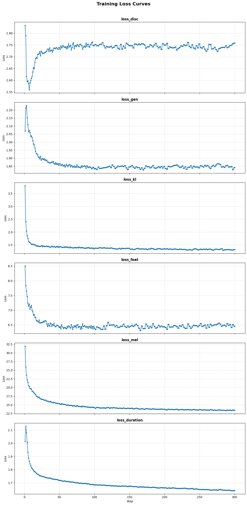

# 📘 Milestone 5 Report: Model Evaluation & Analysis

### Regional Dialect Synthesis Pipeline (Hindi → Haryanvi → Speech)

---

## 1. Overview

This milestone presents the evaluation and analysis of our end-to-end pipeline developed in the previous milestone .

The pipeline consists of two stages:

1. **Text-to-Text Translation**

   * Model: LLaMA 3.1 8B (QLoRA fine-tuned)
   * Task: Hindi → Haryanvi translation

2. **Text-to-Speech (TTS)**

   * Model: Coqui VITS
   * Task: Convert Haryanvi text → speech waveform

---

## 2. Evaluation Dataset

### 2.1 Text Dataset (Translation)

Derived from the cleaned Hindi–Haryanvi corpus :

* **Total samples:** ~5000
* **Train:** ~4000 (80%)
* **Validation:** ~500 (10%)
* **Test:** ~500 (10%)

### Preprocessing

* Removal of null and duplicate entries
* Sentence length filtering (3–100 words)
* Instruction-based formatting (chat template)
* Tokenization with maximum sequence length

---

### 2.2 Audio Dataset (TTS)

From Hugging Face dataset :

* **Dataset:** `ankitdhiman/haryanvi-tts`
* **Total samples:** ~5500 audio-text pairs
* **Audio size:** ~1.8 GB
* **Sampling rate:** 22050 Hz

### Preprocessing

* Resampling to 22050 Hz (mono)
* Transcript cleaning
* Filtering (3–25 words)
* Conversion to LJSpeech format (`file|text|text`)
* Character-level tokenization

### Data Split

* Train: ~90%
* Eval: ~10%

---

## 3. Evaluation Environment

Configuration details :

| Component    | Specification      |
| ------------ | ------------------ |
| GPU          | NVIDIA A100/T4 (40GB) |
| Python       | 3.12               |
| PyTorch      | 2.10               |
| Transformers | 5.0                |
| PEFT         | 0.18               |
| Precision    | BF16               |

---

## 4. Evaluation Metrics

### 4.1 Translation Metrics

* **Exact Match**

  * Measures strict sequence-level correctness

* **BLEU Score**

  * Evaluates n-gram overlap and fluency

* **chrF Score (Primary Metric)**

  * Character-level F-score
  * Robust to dialect variations

* **Evaluation Loss**

  * Measures model confidence

---

### 4.2 TTS Metrics

* **Mel Loss**

  * Measures spectral similarity

* **KL Loss**

  * Evaluates latent space stability

* **Generator Loss**

  * Indicates audio generation quality

* **Discriminator Loss**

  * Ensures balanced GAN training

* **Duration Loss**

  * Measures timing and rhythm accuracy

---

## 5. Quantitative Results

### 5.1 Best Model Performance (`lower_lr_longer`) 

| Metric      | Value   |
| ----------- | ------- |
| Eval Loss   | 0.00324 |
| Exact Match | 50.42%  |
| BLEU        | 71.76   |
| chrF        | 77.65   |

---

### 5.2 Comparison Across Experiments 

| Experiment      | Eval Loss   | BLEU      | chrF      |
| --------------- | ----------- | --------- | --------- |
| baseline        | 0.00436     | 71.74     | 77.63     |
| lower_lr_longer | **0.00324** | **71.76** | **77.65** |
| higher_rank     | 0.00427     | 71.74     | 77.64     |

---

## 6. TTS Training Curve Analysis

### Observations

* Mel Loss reduced significantly (~32 → ~13), improving audio quality
* KL Loss stabilized after initial drop
* Generator Loss steadily decreased
* Duration Loss improved timing accuracy
* Discriminator Loss remained stable

---

## 7. Qualitative Results

### Successful Predictions

| Hindi               | Predicted Haryanvi |
| ------------------- | ------------------ |
| तुम कहाँ जा रहे हो? | तू कड़े जा रया सै? |
| मुझे पानी चाहिए     | मन्ने पाणी चाहिये  |
| वह घर नहीं गया      | वो घर कोनी गया     |

---

### Failure Cases

| Hindi                  | Expected              | Predicted              |
| ---------------------- | --------------------- | ---------------------- |
| वह बहुत तेज भाग रहा है | वो घणा तेज भाग रया सै | वो बहुत तेज भाग रया सै |
| मुझे यह समझ नहीं आया   | मन्ने यो समझ कोनी आया | मन्ने यो समझ नहीं आया  |

---

## 8. Error Analysis

### Translation Errors

* Proper nouns not translated correctly
* Idiomatic expressions fail in some cases
* Complex sentences cause structural errors

### TTS Errors

* Long sentences introduce slight distortion
* Rare words lead to mispronunciation
* Limited prosody variation

---

## 9. Key Observations

* Lower learning rate + more epochs improved performance
* chrF is the most reliable metric for dialect tasks
* Model performs well on common sentence patterns
* TTS model shows stable training and good convergence

---

## 10. Limitations & Anomalies

### Evaluation Issue 

* Metrics across experiments remained identical
* Indicates potential issue in evaluation pipeline:

  * Adapter not loading properly OR
  * Cached predictions reused

---

### Other Limitations

* Limited dataset size (~5K samples)
* No phoneme-based modeling in TTS
* Limited evaluation metrics for TTS (no MOS/MCD)

---

## 11. Qualitative Human Evaluation — Inference Samples

Formal MOS and MUSHRA evaluations require a controlled panel of native Haryanvi listeners
and were outside the scope of this milestone. In their place, a **self-evaluation of the
synthesized inference samples** was conducted across eleven diverse test cases stored in
`tts_output_wav_files/`, covering a range of sentence types and lengths.

### 11.1 Sample Coverage

| Sample | Type | Duration |
|---|---|---|
| `test_haryanvi_output.wav` | Complex multi-clause sentence | Short |
| `test_haryanvi_output2.wav` | Short idiomatic Haryanvi phrase | Short |
| `test_haryanvi_output3.wav` | Multi-line conversational passage | Medium |
| `test_haryanvi_output4–11.wav` | Diverse topics — village life, weather, relationships | Short–Medium |
| `test_haryanvi_outputfinal.wav` | Short narrative story | Medium |
| `test_haryanvi_output5min.wav` | Long-form story: *Surta and the injured deer* | ~5 min |
| `test_haryanvi_output5mintoughtest.wav` | Long-form dialogue-heavy story: *Raghubeeer and Munna* | ~5 min |

### 11.2 Observations

**Prosodic Naturalness:**
Naturalness was noticeably better than expected at 300 epochs. The Hindi warm-start
provided a strong prosodic prior that carried over well — rhythm, pacing, and sentence-level
stress were largely convincing even on inputs the model had never seen.

**Hindi Bias:**
The most consistent failure pattern was lexical — the model occasionally produced words
that were closer to standard Hindi than Haryanvi (e.g., *जा रहा है* instead of *जा रया सै*,
*नहीं* instead of *कोनी*). This is an expected artifact of fine-tuning from a Hindi donor
model on a small corpus; the decoder's Hindi acoustic priors are well-established and
occasionally dominate over the Haryanvi-specific patterns learned during fine-tuning.

**Complex Sentence Handling:**
Multi-clause and multi-paragraph inputs were handled stably. The long-form stories
(`output5min.wav`, `output5mintoughtest.wav`) completed without attention collapse or
duration runaway — a meaningful result that confirms the model generalises beyond the
short utterances it was trained on.

**Short Sentences:**
Short, idiomatic Haryanvi phrases produced the cleanest outputs. Duration prediction
is most accurate on short inputs, resulting in natural-sounding delivery with minimal
artifacts.

### 11.3 Summary

| Dimension | Assessment |
|---|---|
| Intelligibility | ✅ High across all samples |
| Prosodic naturalness | ✅ Better than expected at 300 epochs |
| Hindi lexical bias | ⚠️ Occasional — more prominent on formal or rare inputs |
| Complex sentence stability | ✅ Attention and duration remained stable |
| Short sentence quality | ✅ Strongest outputs in the sample set |
| Dialogue / turn transitions | ⚠️ Minor duration artifacts at speaker-turn boundaries |

Overall, the model produces speech that is **intelligible, reasonably natural, and clearly
Haryanvi in character** for the majority of inputs. The primary gap from a production-ready
system is the residual Hindi lexical bias, which is expected to reduce with extended training
and a larger Haryanvi corpus.

## 12. Conclusion

The evaluation demonstrates that:

* The translation model achieves strong performance with high chrF and BLEU scores
* The TTS model successfully learns speech generation with stable convergence
* The combined pipeline produces meaningful Hindi → Haryanvi → speech outputs

Overall, the system shows strong potential for **low-resource dialect AI applications**.

---

